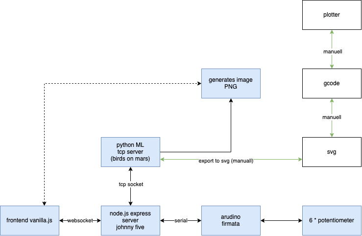

# Maps Latent Space

An AI exploration on how to create maps and a infrastructure to display it in an exhibition space.
A collaboration between Birds On Mars and Technologiestiftung Berlin/CityLAB.

---

This repository contains:

- [ml](ml/) The actual Python Machine Learning Setup
- [server](server/) A Express/Johnny Five server that takes care of routing requests from the hardware and the client to the ml Setup
- [client](client/) A HTML frontend to display the generated maps.

## Todo

- [ ] Build the exhibit
- [ ] Test with all potentiometers connected

## Structure

This is a simple diagram to show how the structure of the application is.

## Contributors ✨

Thanks goes to these wonderful people ([emoji key](https://allcontributors.org/docs/en/emoji-key)):

<!-- ALL-CONTRIBUTORS-LIST:START - Do not remove or modify this section -->
<!-- prettier-ignore-start -->
<!-- markdownlint-disable -->
<table>
  <tr>
    <td align="center"><a href="https://fabianmoronzirfas.me/"> <b>Fabian Morón Zirfas</b></a> <a href="https://github.com/technologiestiftung/maps-latent-space/commits?author=ff6347" title="Code">💻</a> <a href="https://github.com/technologiestiftung/maps-latent-space/commits?author=ff6347" title="Documentation">📖</a></td>
    <td align="center"><a href="https://github.com/birdNicolas"> <b>birdNicolas</b></a> <a href="https://github.com/technologiestiftung/maps-latent-space/commits?author=birdNicolas" title="Code">💻</a></td>
    <td align="center"><a href="https://github.com/vogelino"> <b>Lucas Vogel</b></a> <a href="https://github.com/technologiestiftung/maps-latent-space/commits?author=vogelino" title="Documentation">📖</a></td>
  </tr>
</table>

<!-- markdownlint-restore -->
<!-- prettier-ignore-end -->

<!-- ALL-CONTRIBUTORS-LIST:END -->

This project follows the [all-contributors](https://github.com/all-contributors/all-contributors) specification. Contributions of any kind welcome!

## Credits

<table>
  <tr>
    <td>
      <a src="https://citylab-berlin.org/en/start/">
         
         
        
      </a>
    </td>
    <td>
      <a src="https://www.birdsonmars.com/">
         
         
        
      </a>
    </td>
    <td>
      A project by: <a src="https://www.technologiestiftung-berlin.de/en/">
         
         
        
      </a>
    </td>
    <td>
      Supported by: <a src="https://www.berlin.de/en/">
         
         
        
      </a>
    </td>
  </tr>
</table>
